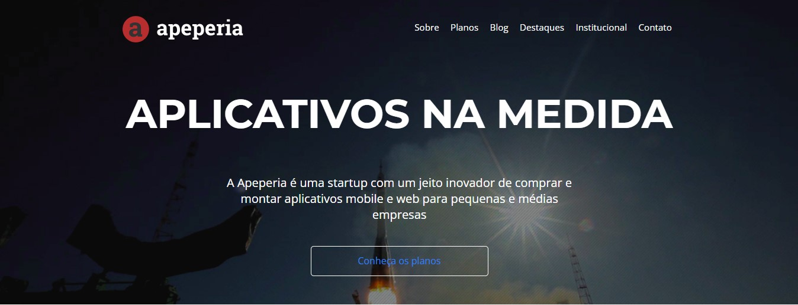
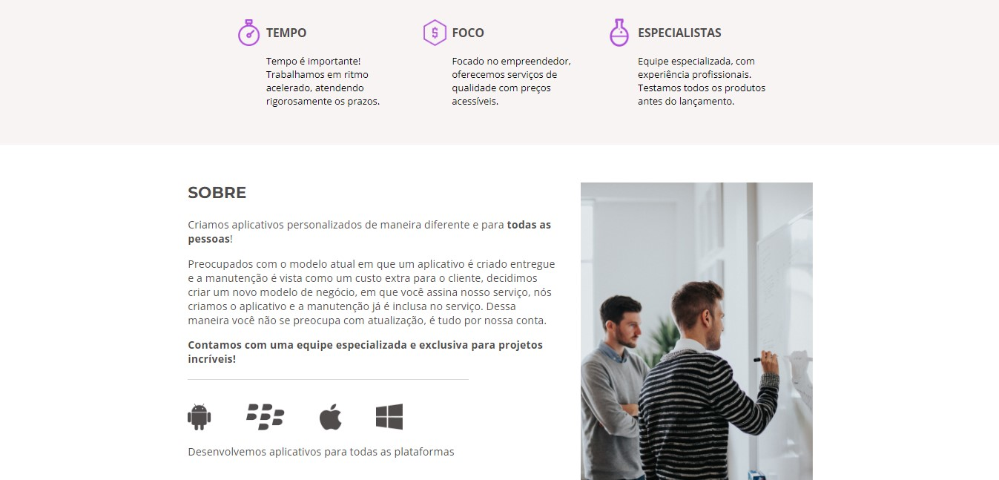
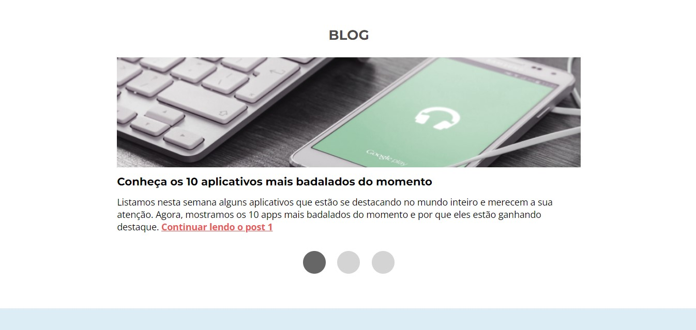
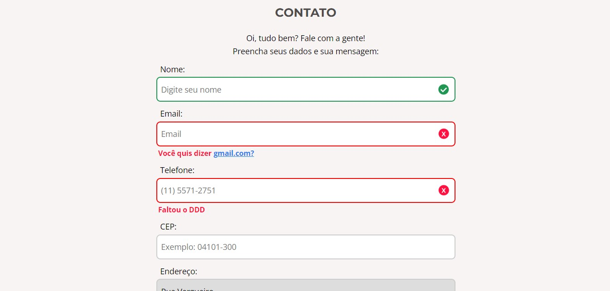
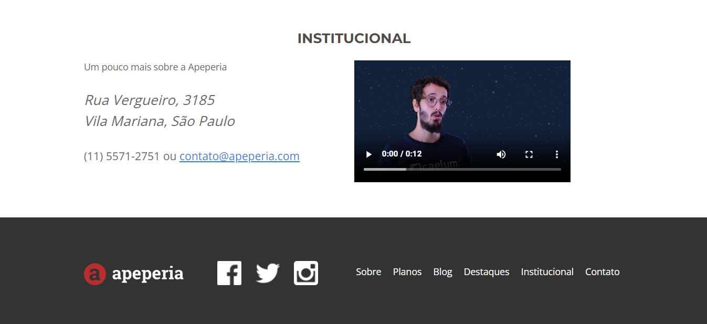

# Apeperia - aplicativos sob medida

Nesse projeto feito durante o curso de <b>Acessibilidade Web</b> da <b>Alura</b>, onde eu desenvolvi um site fictício de uma Startap, utlizando <b>HTML, CSS e JAVSCRIPT</b>. Onde foi abordado os principais meios de deixar uma aplicação web mais acessível para pessoas PCD, principalmente quem tem problemas de visão e audição, com o auxílio do <b>NDVA</b> (leitor de tela) para o desenvolvimento.

<h2>Tópicos abordados durante esse projeto:<h2>
<ul>
<li>Melhorando o site para usuários de leitor de tela.</li>
<li>Entendendo como uma pessoa cega usa a internet.</li>
<li>Testar o site usando o NVDA.</li>
<li>Como detalhes no código podem impactar as pessoas.</li>
<li>Técnicas front-end que podem ajudar seus usuários.</li>
<li>Deixando o projeto ainda mais inclusivo.</li>
</ul>

<h3>Contribuindo</h3>

⭐️ Star o projeto

🐛 Encontrar e relatar issues